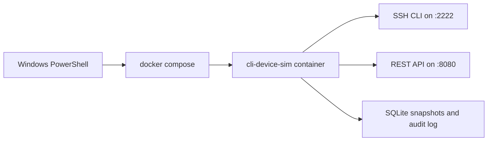
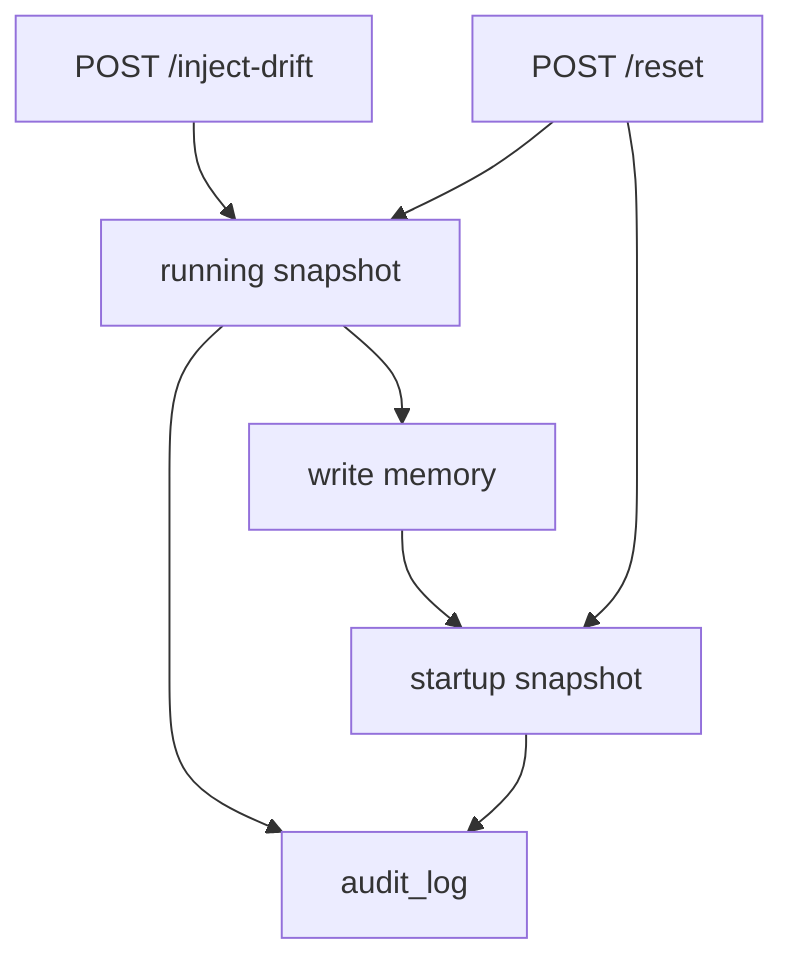

# cli-device-sim

[](https://github.com/RedBeret/cli-device-sim/actions/workflows/ci.yml)
[](LICENSE)

A Windows-first, local-only synthetic network device lab for SSH automation training.

Built by RedBeret for pipeline demos, CLI workflow practice, and safe infrastructure learning without real hardware, customer data, or production credentials.

## Why this repo exists

Real switches and routers are the wrong place to learn prompt transitions, config save behavior, drift handling, and automation retries.

`cli-device-sim` gives you a realistic enough target to practice:

- SSH-based automation
- prompt-aware CLI workflows
- running versus startup config behavior
- health checks, audit trails, and rollback habits

Everything is synthetic. Hostnames, IPs, users, serial numbers, and secrets are fake on purpose.

## What this teaches

- How exec, privileged exec, global config, and interface config modes fit together
- Why `write memory` matters
- How to inspect dirty state and synthetic drift
- How to build Windows-first local demos around Docker and PowerShell
- How to test automation safely before it touches anything real

## What this is not

- It is not a full network operating system
- It is not a vendor-specific emulator
- It is not a replacement for hardware lab validation
- It is not a source of real customer data, real credentials, or proprietary images

## Quick start

### One-command demo from Windows PowerShell

```powershell
.\scripts\Start-Sim.ps1 -Demo
```

This path:

- builds and starts the Docker service
- waits for health
- resets the simulator to a known baseline
- logs in over SSH
- applies a config change
- saves it
- prints recent audit activity

The demo is designed to finish in under 5 minutes.

### Manual start

```powershell
.\scripts\Start-Sim.ps1
```

### Probe SSH login

```powershell
.\scripts\Test-SshLogin.ps1
```

### Open an interactive session

```powershell
ssh operator@127.0.0.1 -p 2222
```

### Stop the simulator

```powershell
.\scripts\Stop-Sim.ps1
```

## Default synthetic values

- Hostname: `LAB-EDGE-01`
- Loopback: `192.0.2.1`
- Example uplink: `198.51.100.10`
- Example access port: `203.0.113.20`
- Serial: `SIM-FTX0001LAB`
- Users: `operator`, `automation`
- Secrets: `lab-operator`, `lab-automation`

## Feature set

- Python 3.12 app runtime
- Paramiko SSH server
- FastAPI inspection API
- SQLite persistence for running and startup config
- Pydantic validation
- Typer CLI entrypoints
- PowerShell wrappers for Windows users
- WSL-friendly `Makefile`
- Structured JSON logging
- Audit log persistence
- Health checks, retries, backoff, and bounded timeouts
- Idempotent reset, drift injection, and save workflows

## Supported CLI commands

- `enable`
- `disable`
- `terminal length 0`
- `show version`
- `show running-config`
- `show startup-config`
- `show interfaces summary`
- `configure terminal`
- `hostname <name>`
- `username <name> secret <value>`
- `interface <name>`
- `description <text>`
- `no shutdown`
- `end`
- `write memory`

Also supported for operator convenience:

- `shutdown`
- `exit`
- `quit`

## REST inspection API

- `GET /healthz`
- `GET /state`
- `GET /running-config`
- `POST /reset`
- `POST /inject-drift`

## Architecture



## Running versus startup config

The simulator stores two separate snapshots:

- `running`
- `startup`

That split is the core teaching model. CLI changes update running config first. `write memory` copies running config into startup config.



## Windows-first workflow

- Primary entrypoint is PowerShell 7 on Windows
- Docker is the default runtime path
- WSL is optional for local developer workflows
- Linux-only tooling stays in Docker or WSL

## Rollback notes

Every mutating workflow has rollback guidance in [docs/runbook.md](docs/runbook.md).

Short version:

- CLI config changes can be reversed manually, or reset completely
- `write memory` has no single-command undo, so reset and replay the desired baseline if needed
- `POST /inject-drift` can be corrected through the CLI or cleared with reset
- `POST /reset` intentionally overwrites both snapshots, so inspect or export state first if you need to preserve it

## Repo layout

- [`src/cli_device_sim/`](src/cli_device_sim)
- [`scripts/`](scripts)
- [`tests/`](tests)
- [`docs/engineering-notes.md`](docs/engineering-notes.md)
- [`docs/study-guide.md`](docs/study-guide.md)
- [`docs/runbook.md`](docs/runbook.md)
- [`docs/failure-modes.md`](docs/failure-modes.md)
- [`docs/review-questions.md`](docs/review-questions.md)
- [`docs/adr/`](docs/adr)

## Docs index

- [Engineering Notes](docs/engineering-notes.md)
- [Study Guide](docs/study-guide.md)
- [Runbook](docs/runbook.md)
- [Failure Modes](docs/failure-modes.md)
- [Review Questions](docs/review-questions.md)
- [ADR 0001](docs/adr/0001-docker-first-windows-entrypoint.md)
- [ADR 0002](docs/adr/0002-snapshot-backed-state-model.md)
- [ADR 0003](docs/adr/0003-single-process-api-and-ssh-runtime.md)

## Developer workflow

If you are using WSL or another Linux shell, the common targets are:

```bash
make up
make demo
make down
```

If you want the Windows-first path, stay in PowerShell and use the scripts in [`scripts/`](scripts).

## Publishing notes

This repo is set up for a GitHub audience:

- relative links work on GitHub
- Mermaid diagrams render in GitHub markdown
- the README leads with value, safety, and quick start
- the docs folder supports deeper study without bloating the front page

## License

This project is licensed under the [MIT License](LICENSE).
# cli-device-sim
