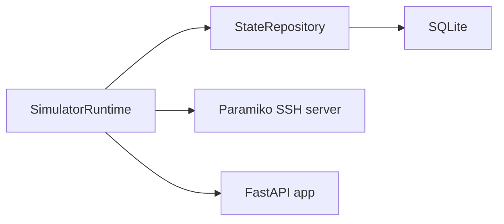

# Engineering Notes

## Goal

Build a lightweight, realistic-enough CLI target for automation training while staying local-only, Windows-first, and safe to reset.

## State modeling

The simulator uses two SQLite-backed snapshots:

- `running`
- `startup`

That choice keeps the most important training concept visible: configuration can exist in memory before it is saved.

Each snapshot stores a validated `DeviceConfig` payload. Audit entries are appended separately so trainees can review CLI commands, auth attempts, API mutations, and drift events without parsing log files.

## Why snapshots instead of line-by-line config text

- Validation is explicit through Pydantic models.
- Rendering to CLI text stays deterministic.
- Mutating workflows can be idempotent because object equality is easy to check.
- Tests can compare state without scraping terminal output.

## Service topology

The runtime starts the SSH listener and API in one Python process. That keeps the demo footprint small and avoids adding a process supervisor just for a training repo.

## CLI mode handling

Per-session mode is tracked in memory and does not persist:

- exec: `>`
- privileged exec: `#`
- global config: `(config)#`
- interface config: `(config-if)#`

Persistent device state is stored centrally in SQLite. Prompt state is session-local.

## Validation

Validation happens in two places:

- Pydantic validates hostnames, usernames, interface names, secrets, and interface descriptions.
- PowerShell wrappers validate that Docker exists and that the simulator becomes healthy before demo steps run.

Invalid data should fail fast with an explicit message rather than being silently accepted.

## Retries, backoff, and timeouts

- SQLite writes retry with exponential backoff when the database is locked.
- API and PowerShell health checks retry with backoff.
- SSH auth, socket, and channel reads use bounded timeouts.
- Demo and test helpers wait for prompts and health with fixed deadlines.

## Structured logging

Application logs are emitted as JSON to stdout. Fields include:

- timestamp
- level
- logger
- message
- event-specific fields such as path, status code, or port

This repo also keeps a durable audit trail in SQLite because training exercises often need a stable artifact after container restarts.

## Health checks

`GET /healthz` reports whether both the API thread and SSH listener are up. Docker Compose uses the same endpoint for container health.

## Synthetic defaults

- Hostname: `LAB-EDGE-01`
- Loopback: `192.0.2.1`
- Uplink: `198.51.100.10`
- Access port: `203.0.113.20`
- Serial: `SIM-FTX0001LAB`

No defaults map to real customers, real hardware, or real corporate naming schemes.
