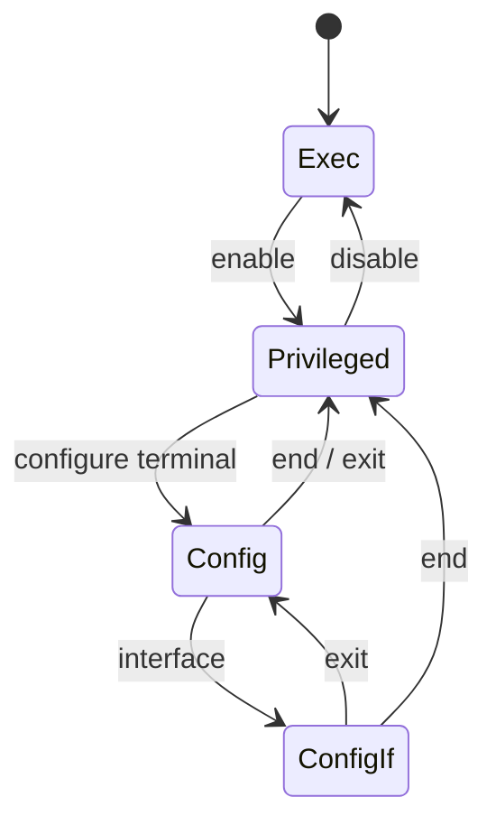

# Study Guide

## Mode transitions

The simulator is intentionally built around the most common device CLI transitions.

## Core mental model

- `>` means you are in exec mode.
- `#` means you are in privileged exec mode.
- `(config)#` means mutations affect running config.
- `(config-if)#` means mutations affect the selected interface under running config.
- `write memory` copies running config into startup config.

## Practice sequence

1. Start the simulator with [scripts/Start-Sim.ps1](../scripts/Start-Sim.ps1).
2. Log in with `ssh operator@127.0.0.1 -p 2222`.
3. Enter `enable`.
4. Inspect current state with `show version` and `show running-config`.
5. Enter `configure terminal`.
6. Change the hostname or an interface description.
7. Use `end` and inspect `show running-config`.
8. Compare `show startup-config` before and after `write memory`.

## Suggested exercises

### Exercise 1

Change the hostname to `LAB-EDGE-STUDENT`, then confirm that the prompt changes immediately.

### Exercise 2

Enable `GigabitEthernet0/2`, save the config, stop the simulator, start it again, and verify the state persisted.

### Exercise 3

Call `POST /inject-drift`, inspect `GET /state`, and explain why the simulator reports dirty state.

### Exercise 4

Attempt `configure terminal` before `enable` and explain why it fails.

## Concepts to watch for

- difference between session state and persisted device state
- difference between running and startup config
- idempotent operations like repeated `no shutdown`
- audit evidence after auth, CLI commands, and API mutations
